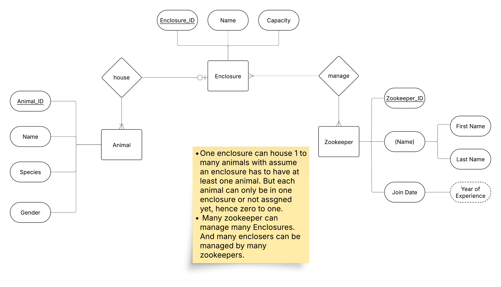

# HW4
## Part 1 
Please see the folder: [processed_data](./processed_data/) for the output. And code: [data_processing.py](data_processing.py) for the code details.
## Part 2 - ER Diagram

I chose Animal, Enclosure, and Zookeeper because they represent the core components of a zoo management system: the animals being cared for, the spaces they live in, and the people responsible for their welfare.

### Entities
`Animal`:
- Animal includes ID, Name, Species and Gender

`Enclosure`:
- Enclosure includes ID, name and Capacity (maximum).

`Zookeeper`:
- Zookeeper incldues ID, name (composition: with first and last name), Join Date, and we can get Year of experience at this zoo from Join Date.
- Note the join date cannot be after the curret year and cannot before the year that the zoo is built.

### Relationship

- One enclosure can house 1 to many animals with assume an enclosure has to have at least one animal. But each animal can only be in one enclosure or not assgned yet, hence zero to one.
- Many zookeeper can manage many Enclosures. And many enclosers can be managed by many zookeepers.
  
# HW4 Description
(Due 2/17)
Part 1 (50 points): Normalization and Standardization 
Take the iris data set and create two new .csv data sets (25 points each). One that normalizes all columns to have values between 0 and 1 and a second that standardizes all columns to have a mean of 0 and standard deviation of 1.
Push both files to github. 

Part 2 (50 points): ER Diagram 
Create an ER diagram that models a zoo:
Define at least three entities that have several attributes for each entity, their relationship between entities, and their constraints. Argue your decisions. You will graded based on your explanation on why you chose certain constraints. 
What to submit 
Either create a markdown readme file that has a copy of your ER diagram and explanation or .pdf version and push that to github.
Please also submit a link to your github submission to Canvas as well. This helps the TA grade faster. 